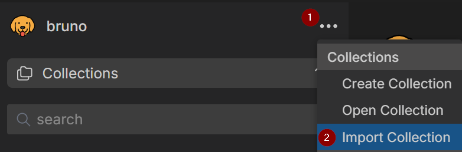
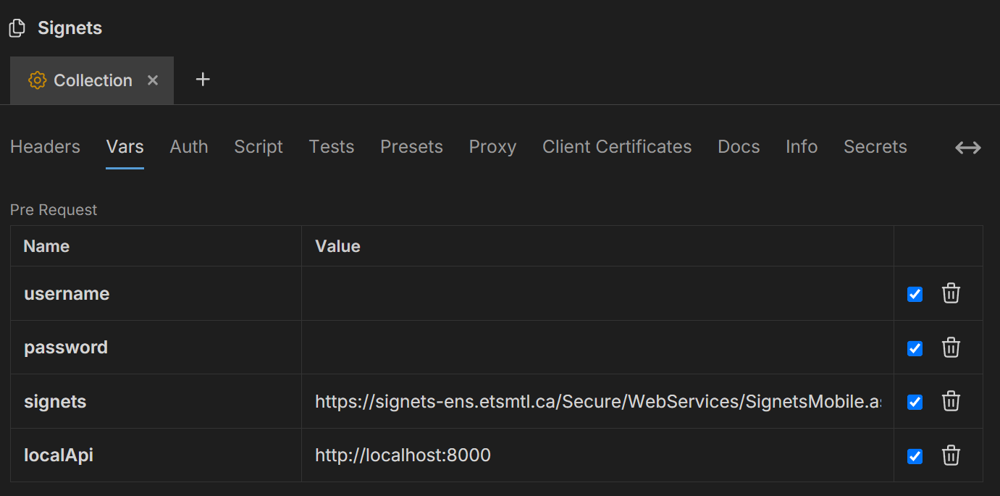

# LocalSignets

Local API for Signets

## Getting Started

### Prerequisites

*This project was built and tested on Python v3.12*

- Python 3
    ```
    python --version
    ```

### Installation

1. Clone the repo
2. Navigate to the cloned directory
3. Install dependencies
    ```bash
    # Create a virtual environment (recommended)
    python -m venv .venv
    source ./.venv/bin/activate  # On Windows use `.venv\Scripts\activate

    # Install requirements
    pip install -r requirements.txt
    ```
4. Configure your `./responses` directory.
   - To start, you can create a directory called `responses` in the root of this project and copy all the contents from `./responses-template` into it. The data in the `./responses` directory is what the API will return. If you want to fill it with you own data, you can retrieve your data with [the bruno collection](#bruno).
   - To use your own data, you can retrieve it directly from the Signets API using the Bruno collection in the `docs/` directory. More info [here](#using-custom-data).
5. Run the API
   ```bash
   python signets.py
   ```
6. Get the IP address of the machine running the server
7. Point your ETSMobile application to use your local API
    - Go to `urls.dart` in Notre-Dame
        ```bash
        # Replace
        static const String signetsAPI = "https://signets-ens.etsmtl.ca/Secure/WebServices/SignetsMobile.asmx";

        # With
        static const String signetsAPI = http://<IP_FROM_STEP_6>:8000
        ```

ETSMobile should now use your local API instead of the remote one. You can add/modify files in the responses directory to fit your needs.

Additionnally, you can retrieve the XML from Signets or your local API using the Bruno collection in `./docs/signets.json`. More info [here](#bruno-collection).

## Using Custom Data

By default all the XML responses can be found in their respective directories inside the `responses` directory.
You can edit the XML files as you see fit.

### File Structure

| Directory         | Description                                                     | File Naming                      |
| ----------------  | ------                                                          | -----------                      |
| auth              |  Response if user authentication is valid                       | `auth.xml`                       |
| cours             |  Response of all the user's courses                             | `cours.xml`                      |
| evaluation-cours  |  Responses of all the user's teacher evaluations per session    | `session_{SESSION}.xml`          |
| evaluations       |  Responses of all the user's evaluations per course             | `{COURSE}_{GROUP}_{SESSION}.xml` |
| horaire-prof      |  Responses of all schedule per teacher per session              | `session_{SESSION}.xml`          |
| horaires          |  Responses of all user's schedule per session                   | `session_{SESSION}.xml`          |
| info              |  Response of the user's information                             | `infoEtudiant.xml`               |
| programmes        |  Response of the user's academic programs                       | `programmes.xml`                 |
| sessions          |  Response of the user's sessions                                | `sessions.xml`                   |

## Bruno

### Step 1. Import the collection

Import the `signets.json` into your Bruno client.



### Step 2. Set Collection Variables

Set your username and password that you use for ETSMobile.
Additionally, you could set the `localAPI` address if you have the API running on another machine.



### Step 3. Calling Endpoints

You can now call the endpoints from the imported collection.
- To call the Signets production endpoint use `{{signets}}` as the endpoint.
- To call your local API use `{{localAPI}}` as the endpoint.

*Note that some endpoints require you to specify some data in the request body. (e.g: listeElementsEvaluation, listeHoraireEtProf, listeHoraireDesSeances, listeEvaluationCours)*